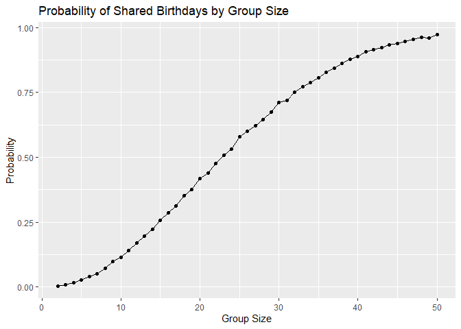
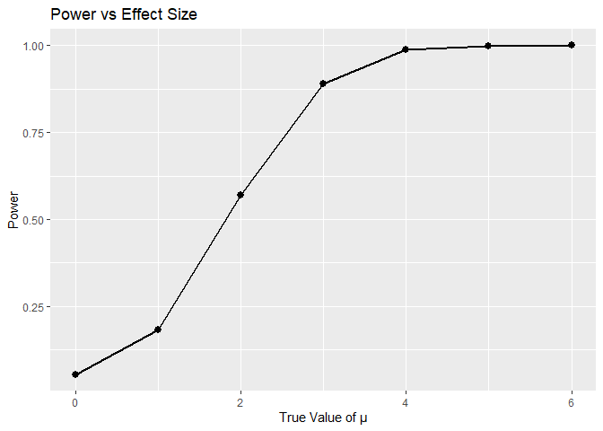
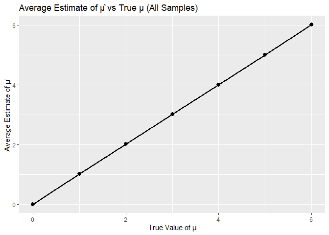
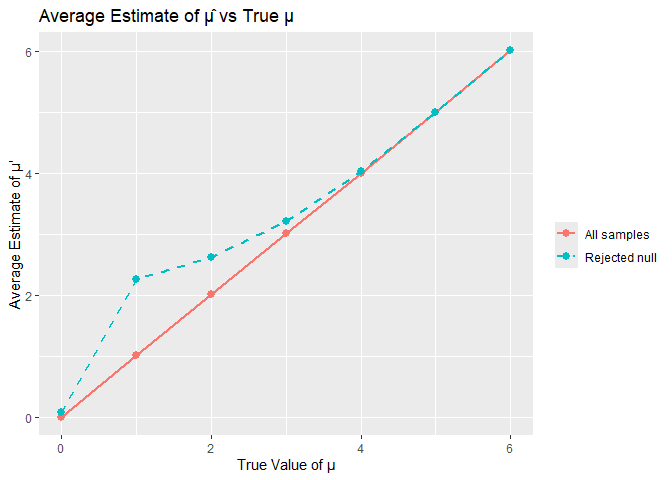
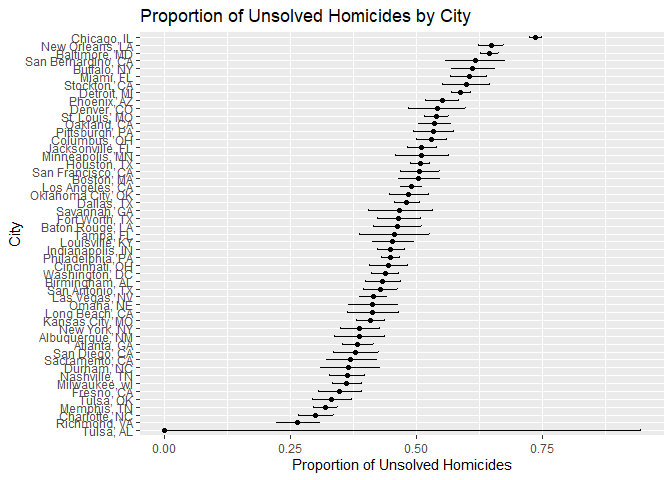

p8105_hw5_tl3391
================
Tong Liu
2025-11-14

# Question 1

``` r
simulate_birthday = function(group_size) {
  sampled_birthdays = sample(1:365, size = group_size, replace = TRUE)
  # Check if there are any duplicate birthdays
  has_duplicate = any(duplicated(sampled_birthdays))
  # Return TRUE if duplicates exist, FALSE otherwise
  return(has_duplicate)
}

simulate_birthday(5)
```

    ## [1] FALSE

``` r
simulate_birthday(20)
```

    ## [1] FALSE

``` r
simulate_birthday(50)
```

    ## [1] TRUE

``` r
birthday_results = 
  tibble(group_size = 2:50) %>%
  mutate(
    probability = map_dbl(group_size, function(n) {
      # Run simulation 10,000 times
      simulation_runs = replicate(10000, simulate_birthday(n))
      mean(simulation_runs)
    })
  )

head(birthday_results, 10)
```

    ## # A tibble: 10 × 2
    ##    group_size probability
    ##         <int>       <dbl>
    ##  1          2      0.0039
    ##  2          3      0.0086
    ##  3          4      0.0172
    ##  4          5      0.0278
    ##  5          6      0.0406
    ##  6          7      0.0515
    ##  7          8      0.0722
    ##  8          9      0.0975
    ##  9         10      0.113 
    ## 10         11      0.140

## Visualize Results

``` r
birthday_results %>%
  ggplot(aes(x = group_size, y = probability)) +
  geom_line() +
  geom_point() +
  labs(
    title = "Probability of Shared Birthdays by Group Size",
    x = "Group Size",
    y = "Probability"
  )
```

<!-- -->

# Question 2

``` r
# Set design elements
n = 30
sigma = 5
mu_values = 0:6
alpha = 0.05
n_simulations = 5000
```

``` r
sim_t_test = function(mu, n = 30, sigma = 5) {
  # Generate dataset from normal distribution
  sample_data = rnorm(n, mean = mu, sd = sigma)
  # Perform t-test (H0: mu = 0)
  test_result = t.test(sample_data, mu = 0)
  tidy_result = broom::tidy(test_result)
  
  tibble(
    mu_hat = tidy_result$estimate,
    p_value = tidy_result$p.value
  )
}
```

``` r
# Run simulations for each mu value
sim_results = 
  tibble(mu = mu_values) %>%
  mutate(
    results = map(mu, function(mu_val) {
      map_dfr(1:n_simulations, ~sim_t_test(mu_val))
    })
  ) %>%
  unnest(results)
```

``` r
# Calculate power for each mu
power_results = 
  sim_results %>%
  group_by(mu) %>%
  summarize(
    power = mean(p_value < alpha)
  )
```

## Plot 1: Power vs Effect Size

``` r
power_results %>%
  ggplot(aes(x = mu, y = power)) +
  geom_line(linewidth = 1) +
  geom_point(size = 2.5) +
  labs(
    title = "Power vs Effect Size",
    x = "True Value of μ",
    y = "Power"
  )
```

<!-- -->

**Description of association:** The plot shows a strong positive
association between effect size and power. When μ = 0 (null is true),
power is approximately 0.05, which equals the significance level α. As
the effect size increases, power increases rapidly. By μ = 4, power
approaches 1.0, meaning the test almost always correctly rejects the
null hypothesis when the true effect is large.

``` r
estimate_summary = 
  sim_results %>%
  group_by(mu) %>%
  summarize(
    avg_mu_hat_all = mean(mu_hat),
    avg_mu_hat_rejected = mean(mu_hat[p_value < alpha])
  )
```

## Plot 2: Average Estimate vs True Value

``` r
estimate_summary %>%
  ggplot(aes(x = mu)) +
  geom_line(aes(y = avg_mu_hat_all), linewidth = 1) +
  geom_point(aes(y = avg_mu_hat_all), size = 2.5) +
  labs(
    title = "Average Estimate of μ̂ vs True μ (All Samples)",
    x = "True Value of μ",
    y = "Average Estimate of μ'"
  )
```

<!-- -->

## Plot 3: Overlay with Rejected Nulls Only

``` r
estimate_summary %>%
  ggplot(aes(x = mu)) +
  geom_line(aes(y = avg_mu_hat_all, color = "All samples"), linewidth = 1) +
  geom_point(aes(y = avg_mu_hat_all, color = "All samples"), size = 2.5) +
  geom_line(aes(y = avg_mu_hat_rejected, color = "Rejected null"), 
            linewidth = 1, linetype = "dashed") +
  geom_point(aes(y = avg_mu_hat_rejected, color = "Rejected null"), size = 2.5) +
  labs(
    title = "Average Estimate of μ̂ vs True μ",
    x = "True Value of μ",
    y = "Average Estimate of μ'",
    color = ""
  )
```

<!-- -->
\#Is the sample average of μ’across tests for which the null is rejected
approximately equal to the true value of μ? Why or why not? No, the
sample average of μ’ across tests for which the null is rejected is not
approximately equal to the true value of μ when the effect size is
small. When μ is small (1, 2, 3), power is low, meaning most samples
will not reject the null hypothesis. Only samples with unusually large
estimates (due to random sampling variability) will have p-values \<
0.05. Therefore the average μ’ among rejected tests overestimates the
true μ.

# Question 3

``` r
# Load the homicide data
homicide_df = read_csv("data/homicide-data.csv")
```

    ## Rows: 52179 Columns: 12
    ## ── Column specification ────────────────────────────────────────────────────────
    ## Delimiter: ","
    ## chr (9): uid, victim_last, victim_first, victim_race, victim_age, victim_sex...
    ## dbl (3): reported_date, lat, lon
    ## 
    ## ℹ Use `spec()` to retrieve the full column specification for this data.
    ## ℹ Specify the column types or set `show_col_types = FALSE` to quiet this message.

``` r
head(homicide_df)
```

    ## # A tibble: 6 × 12
    ##   uid   reported_date victim_last victim_first victim_race victim_age victim_sex
    ##   <chr>         <dbl> <chr>       <chr>        <chr>       <chr>      <chr>     
    ## 1 Alb-…      20100504 GARCIA      JUAN         Hispanic    78         Male      
    ## 2 Alb-…      20100216 MONTOYA     CAMERON      Hispanic    17         Male      
    ## 3 Alb-…      20100601 SATTERFIELD VIVIANA      White       15         Female    
    ## 4 Alb-…      20100101 MENDIOLA    CARLOS       Hispanic    32         Male      
    ## 5 Alb-…      20100102 MULA        VIVIAN       White       72         Female    
    ## 6 Alb-…      20100126 BOOK        GERALDINE    White       91         Female    
    ## # ℹ 5 more variables: city <chr>, state <chr>, lat <dbl>, lon <dbl>,
    ## #   disposition <chr>

**Description of raw data:**

The dataset contains 52179 observations and 12 variables. It includes
information on homicides in 50 large U.S. cities. Key variables include:

- `uid`: Unique identifier for each case
- `reported_date`: Date the homicide was reported
- `victim_last`, `victim_first`: Victim’s name
- `victim_race`, `victim_age`, `victim_sex`: Victim demographics
- `city`, `state`: Location of the homicide
- `lat`, `lon`: Geographic coordinates
- `disposition`: Case status (Closed by arrest, Closed without arrest,
  Open/No arrest)

The data spans approximately a decade and documents the outcome of
homicide investigations across major U.S. cities.

``` r
# Create city_state variable and summarize
homicide_summary = 
  homicide_df %>%
  mutate(
    city_state = paste(city, state, sep = ", ")
  ) %>%
  group_by(city_state) %>%
  summarize(
    total_homicides = n(),
    unsolved_homicides = sum(disposition %in% c("Closed without arrest", "Open/No arrest"))
  ) %>%
  ungroup()

head(homicide_summary, 10)
```

    ## # A tibble: 10 × 3
    ##    city_state      total_homicides unsolved_homicides
    ##    <chr>                     <int>              <int>
    ##  1 Albuquerque, NM             378                146
    ##  2 Atlanta, GA                 973                373
    ##  3 Baltimore, MD              2827               1825
    ##  4 Baton Rouge, LA             424                196
    ##  5 Birmingham, AL              800                347
    ##  6 Boston, MA                  614                310
    ##  7 Buffalo, NY                 521                319
    ##  8 Charlotte, NC               687                206
    ##  9 Chicago, IL                5535               4073
    ## 10 Cincinnati, OH              694                309

``` r
# Filter for Baltimore
baltimore_data = 
  homicide_summary %>%
  filter(city_state == "Baltimore, MD")
baltimore_test = 
  prop.test(
    x = baltimore_data$unsolved_homicides,
    n = baltimore_data$total_homicides
  )
baltimore_tidy = 
  broom::tidy(baltimore_test) %>%
  select(estimate, conf.low, conf.high)

baltimore_tidy
```

    ## # A tibble: 1 × 3
    ##   estimate conf.low conf.high
    ##      <dbl>    <dbl>     <dbl>
    ## 1    0.646    0.628     0.663

The estimated proportion of unsolved homicides in Baltimore, MD is
0.646, with a 95% confidence interval of \[0.628, 0.663\].

``` r
# Run prop.test for All Cities
prop_test_city = function(x, n) {
  test_result = prop.test(x = x, n = n)
  broom::tidy(test_result) %>%
    select(estimate, conf.low, conf.high)
}
all_cities_results = 
  homicide_summary %>%
  mutate(
    prop_test = map2(unsolved_homicides, total_homicides, prop_test_city)
  ) %>%
  unnest(prop_test)
```

    ## Warning: There was 1 warning in `mutate()`.
    ## ℹ In argument: `prop_test = map2(unsolved_homicides, total_homicides,
    ##   prop_test_city)`.
    ## Caused by warning in `prop.test()`:
    ## ! Chi-squared approximation may be incorrect

``` r
head(all_cities_results, 10)
```

    ## # A tibble: 10 × 6
    ##    city_state     total_homicides unsolved_homicides estimate conf.low conf.high
    ##    <chr>                    <int>              <int>    <dbl>    <dbl>     <dbl>
    ##  1 Albuquerque, …             378                146    0.386    0.337     0.438
    ##  2 Atlanta, GA                973                373    0.383    0.353     0.415
    ##  3 Baltimore, MD             2827               1825    0.646    0.628     0.663
    ##  4 Baton Rouge, …             424                196    0.462    0.414     0.511
    ##  5 Birmingham, AL             800                347    0.434    0.399     0.469
    ##  6 Boston, MA                 614                310    0.505    0.465     0.545
    ##  7 Buffalo, NY                521                319    0.612    0.569     0.654
    ##  8 Charlotte, NC              687                206    0.300    0.266     0.336
    ##  9 Chicago, IL               5535               4073    0.736    0.724     0.747
    ## 10 Cincinnati, OH             694                309    0.445    0.408     0.483

``` r
# Plot Estimates and CIs
all_cities_results %>%
  mutate(city_state = fct_reorder(city_state, estimate)) %>%
  ggplot(aes(x = estimate, y = city_state)) +
  geom_point() +
  geom_errorbarh(aes(xmin = conf.low, xmax = conf.high), height = 0.2) +
  labs(
    title = "Proportion of Unsolved Homicides by City",
    x = "Proportion of Unsolved Homicides",
    y = "City"
  )
```

<!-- -->
